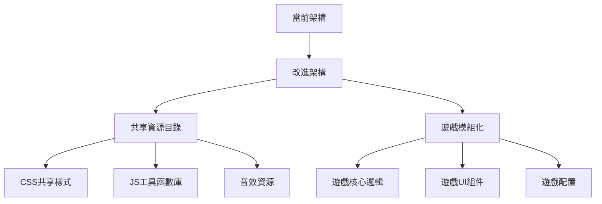

# 遊戲專案改進計劃

## 專案概覽分析

您的遊戲專案是一個優秀的HTML5遊戲集合，包含以下遊戲：
- 🐍 貪吃蛇 (snake.html)
- ⚫⚪ 五子棋 (move.html)
- 🔢 2048 (2048.html)
- 💣 掃雷 (boom.html)
- 🎈 戳泡泡 (bouble.html)
- ✨ 3D粒子系統 (shape.html)
- 🎮 遊戲中心 (index.html)

## 主要優勢
1. **視覺設計優秀** - 現代化的漸層背景和動畫效果
2. **功能完整** - 每個遊戲都有完整的功能實現
3. **響應式設計** - 大部分遊戲都有移動設備適配
4. **代碼結構清晰** - 每個遊戲獨立封裝，易於維護

## 發現的問題與改進建議

### 1. 代碼組織與架構問題

#### 問題：
- 所有CSS和JavaScript都內嵌在HTML文件中，導致代碼冗長
- 重複的代碼模式（如音效系統、遊戲狀態管理）
- 缺乏模組化設計

#### 建議：


### 2. 性能優化機會

#### 問題：
- Canvas遊戲使用`setInterval`而非`requestAnimationFrame`
- 粒子系統可能造成性能問題
- 缺乏資源預加載

#### 建議：
1. **貪吃蛇遊戲**：將`setInterval`改為`requestAnimationFrame`
2. **粒子系統**：添加粒子數量限制和性能監控
3. **資源預加載**：添加加載畫面，預加載遊戲資源

### 3. 可訪問性問題

#### 問題：
- 缺乏ARIA標籤
- 鍵盤導航不完整
- 顏色對比度可能不足

#### 建議：
1. 為所有互動元素添加ARIA標籤
2. 確保所有遊戲功能都可以用鍵盤操作
3. 檢查顏色對比度，確保符合WCAG 2.1 AA標準

### 4. 代碼質量改進

#### 具體問題：
1. **變數命名不一致**：有些使用英文，有些使用中文拼音
2. **錯誤處理不完整**：缺乏try-catch和錯誤邊界
3. **代碼註解不足**：複雜邏輯缺乏說明

#### 建議改進：
```javascript
// 改進前
let fenshu = 0;

// 改進後
let score = 0; // 使用英文變數名，添加註解

// 改進前
function init() {
    // 大量初始化代碼
}

// 改進後
/**
 * 初始化遊戲
 * @param {Object} config - 遊戲配置
 * @returns {boolean} 初始化是否成功
 */
function initializeGame(config) {
    try {
        // 初始化邏輯
        return true;
    } catch (error) {
        console.error('遊戲初始化失敗:', error);
        return false;
    }
}
```

### 5. 響應式設計改進

#### 問題：
- 某些遊戲在極小螢幕上布局問題
- 觸控目標大小不足
- 橫向模式支援不完整

#### 建議：
1. 添加更多斷點（特別是針對平板設備）
2. 確保觸控目標至少44x44像素
3. 添加橫向模式警告或適配

### 6. 功能增強建議

#### 新增功能：
1. **遊戲統計系統**：記錄玩家遊戲數據
2. **成就系統**：增加遊戲挑戰性
3. **雲端存儲**：跨設備同步遊戲進度
4. **社交分享**：分享遊戲成績

#### 改進現有功能：
1. **音效系統**：使用真實音效檔案而非合成音效
2. **動畫效果**：添加更多視覺反饋
3. **遊戲難度**：增加更多難度選項

## 具體實施計劃

### 階段一：基礎架構重構（1-2週）
1. **創建共享資源目錄**
   - `css/` - 共享樣式
   - `js/` - 工具函數庫
   - `assets/` - 圖片、音效資源

2. **提取通用組件**
   - 遊戲控制面板組件
   - 分數顯示組件
   - 音效控制組件

3. **建立開發規範**
   - 代碼風格指南
   - 提交訊息規範
   - 測試流程

### 階段二：性能與可訪問性優化（1週）
1. **性能優化**
   - 實現`requestAnimationFrame`
   - 添加資源懶加載
   - 優化Canvas渲染

2. **可訪問性改進**
   - 添加ARIA標籤
   - 改進鍵盤導航
   - 調整顏色對比度

### 階段三：功能增強（2週）
1. **新增功能開發**
   - 遊戲統計系統
   - 成就系統
   - 設置頁面

2. **現有功能改進**
   - 音效系統升級
   - 動畫效果增強
   - 遊戲平衡調整

### 階段四：測試與部署（1週）
1. **全面測試**
   - 跨瀏覽器測試
   - 移動設備測試
   - 性能測試

2. **部署優化**
   - 資源壓縮
   - 緩存策略
   - CDN部署

## 技術棧建議

### 當前技術棧
- HTML5
- CSS3
- Vanilla JavaScript
- Three.js (3D粒子系統)

### 可考慮的技術升級
1. **構建工具**：Vite或Parcel用於現代化開發
2. **CSS框架**：Tailwind CSS或UnoCSS用於快速開發
3. **狀態管理**：小型狀態管理庫（如Zustand）
4. **測試框架**：Jest + Testing Library

## 優先級建議

### 高優先級（立即處理）
1. 修復貪吃蛇遊戲的性能問題（`setInterval` → `requestAnimationFrame`）
2. 添加基本的錯誤處理
3. 改進移動設備觸控體驗

### 中優先級（近期處理）
1. 創建共享資源目錄
2. 改進可訪問性
3. 添加遊戲統計功能

### 低優先級（長期規劃）
1. 實現雲端存儲
2. 添加社交功能
3. 考慮技術棧升級

## 預期效益

### 技術效益
1. **代碼維護性提升**：模組化設計，減少重複代碼
2. **性能提升**：更好的幀率，更低的資源消耗
3. **可訪問性提升**：符合無障礙標準，擴大用戶群

### 用戶體驗效益
1. **更流暢的遊戲體驗**：優化後的性能
2. **更豐富的功能**：新增的遊戲特性
3. **更好的跨設備體驗**：改進的響應式設計

### 開發效益
1. **更快的開發速度**：共享組件和工具
2. **更容易的測試**：模組化架構
3. **更好的協作**：清晰的代碼規範

## 風險與緩解措施

### 技術風險
1. **重構可能引入bug**
   - 緩解：逐步重構，充分測試

2. **性能優化可能複雜**
   - 緩解：先進行性能分析，針對性優化

3. **瀏覽器相容性問題**
   - 緩解：使用特性檢測和polyfill

### 項目風險
1. **時間估計不準確**
   - 緩解：分階段實施，定期評估進度

2. **功能範圍蔓延**
   - 緩解：明確需求，優先級排序

## 下一步行動建議

1. **立即行動**：
   - 修復貪吃蛇遊戲的性能問題
   - 添加基本的錯誤處理

2. **短期計劃**：
   - 創建`css/shared.css`和`js/utils.js`
   - 開始提取通用組件

3. **中期計劃**：
   - 實施完整的可訪問性改進
   - 開發遊戲統計系統

4. **長期願景**：
   - 考慮技術棧現代化
   - 探索PWA（漸進式網頁應用）可能性

## 結論

您的遊戲專案基礎非常扎實，已經實現了多個完整可玩的遊戲。通過系統性的改進，可以將這個專案提升到專業水準。建議從基礎架構重構開始，逐步實施各項改進，最終打造一個高性能、可訪問、功能豐富的遊戲平台。

如需進一步討論或開始實施，請隨時告知！